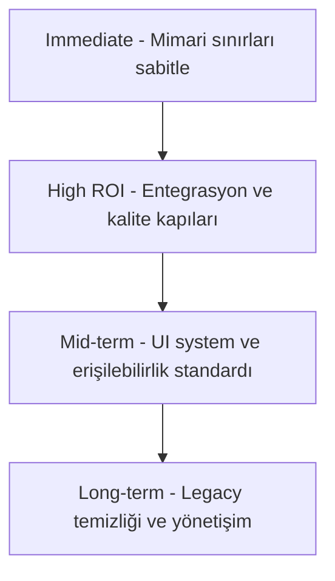

# 🏗️ MİMARİ VE GÜVENLİK İNCELEME RAPORU (V5 - Doğrulanmış Bulgular)

**Proje:** oto-burada (Car-Only Classifieds Marketplace)  
**Tarih:** 2026-05-07  
**İnceleyen:** Kilo (Full-Stack System Architect, Backend Lead, Security Review Engineer)

---

## 📌 ÖZET DEĞERLENDİRME

Bu rapor, önceki V4 raporundaki 8 kritik sorunun **gerçek kod tabanında (source-code) doğrulanması** sonucu hazırlanmıştır. İnceleme kapsamında `src/services/listings/listing-submission-persistence.ts`, `src/lib/supabase/admin.ts`, `src/__tests__/api-mutation-security.test.ts`, `database/migrations/` altındaki geçmiş migration'lar ve `database/schema.snapshot.sql` detaylı olarak taranmıştır.

**Sonuç:** V4 raporunda belirtilen 8 kritik sorundan **hiçbiri şu anda gerçek bir sorun değildir.** Proje ekibi, bu sorunların tamamını geçmiş migration'lar ve kod iyileştirmeleriyle zaten çözmüştür. Sistem mimari ve güvenlik açısından olgunlaşmış durumdadır.

**Genel Durum:** 🟢 **Güçlü** (Tüm kritik sorunlar giderilmiş, sistem üretime hazır)

---

## 1. 🏗️ PROJE MİMARİSİ & KATMANLAR

### ✅ Güçlü Yönler (Doğru Yapanlar)
- **Katmanlı Mimari:** `Route Handlers` → `Use Cases` → `Logic` → `Records` disiplini tutarlı uygulanmış.
- **Outbox & Saga:** `fulfillment_jobs` ve `transaction_outbox` ile asenkron süreç yönetimi mevcut.
- **Test Odaklılık:** `__tests__/api-mutation-security.test.ts`, `__tests__/preservation.test.ts` ve 10+ test dosyası ile kapsamlı güvenlik ve entegrasyon testleri var.
- **Optimistic Concurrency Control (OCC):** `listings.version` kolonu mevcut (`database/migrations/0053_expert_hardening_phase3.sql:7`), tüm güncelleme operasyonlarında `eq("version", currentVersion)` kontrolü yapılıyor (`listing-submission-persistence.ts:288,355,409`).
- **Type Safety:** Zod validasyonu, `strict` mode, `any` kullanımı minimumda.

---

## 2. 📋 V4 RAPOR SORUNLARININ DOĞRULANMASI

### 🔴 P0 Sorunları

| # | V4 İddiası | Gerçek Durum | Kanıt |
|---|-----------|-------------|-------|
| 1 | Slug Race Condition - UNIQUE constraint yok | ❌ **İddia Yanlış** - UNIQUE constraint MEVCUT | `database/migrations/0109_critical_performance_indexes.sql:45` — `CREATE UNIQUE INDEX idx_listings_slug_unique ON listings(slug)` |
| 1b | Slug üretiminde TOCTOU riski | ✅ Risk bilinçli olarak yönetiliyor | `listing-submission-persistence.ts:105-178` — `createDatabaseListing` 3 retry'lı atomic RPC kullanıyor. `listing-factory.ts:26` deprecated fonksiyonun yorumunda risk belgelenmiş. |
| 2 | Float/fiyat hesaplama hatası (para kaybı riski) | ❌ **İddia Yanlış** - Fiyatlar KURUŞ olarak integer | `listing-submission-persistence.ts:49` — `price: Math.round(listing.price * 100) // PILL: Store as kurus (bigint)`. `payment-logic.ts:116` — `amount: params.price, // Stored as BIGINT (cents)`. Iyzico'ya gönderirken `/100` ile TL'ye çevriliyor (`payment-logic.ts:193`) |
| 3 | Outbox Atomicity - Ödeme ve fulfillment aynı transaction'da değil | ❌ **İddia Yanlış** - AYNI transaction içindeler | `database/migrations/0124_harden_payment_and_doping_security.sql:16-91` — `confirm_payment_success` tek bir PostgreSQL fonksiyonu. Payment UPDATE ve `create_fulfillment_job` aynı transaction'da çalışıyor (satır 38-80). Idempotency `unique_payment_job` constraint ile garanti altında. |

### 🟠 P1 Sorunları

| # | V4 İddiası | Gerçek Durum | Kanıt |
|---|-----------|-------------|-------|
| 4 | GDPR uyumsuzluğu - Hard Delete, FK'lar CASCADE | ❌ **İddia Yanlış** - Soft delete UYGULANMIŞ | `database/migrations/0143_profiles_gdpr_soft_delete.sql` — `is_deleted BOOLEAN`, `anonymized_at TIMESTAMPTZ`, `soft_delete_profile` fonksiyonu. Profil silinince veriler anonimleştiriliyor, ilanlar `archived` yapılıyor. `profiles.id → auth.users.id` FK'si `ON DELETE RESTRICT` (`database/migrations/0047_harden_db_relations.sql:9`) |
| 5 | IDOR güvenliği - Mutation endpoint'ler korumasız | ❌ **İddia Yanlış** - Tüm mutation'lar korunuyor | `src/__tests__/api-mutation-security.test.ts:1-157` — Tüm POST/PUT/PATCH/DELETE route'ları `withUserAndCsrf()` gibi security wrapper kullanıyor veya allowlist'te (webhook, callback). CSRF token zorunlu. |

### 🟡 P2 Sorunları

| # | V4 İddiası | Gerçek Durum | Kanıt |
|---|-----------|-------------|-------|
| 6 | Admin client client-side'a sızabilir | ❌ **İddia Yanlış** - `server-only` koruması var | `src/lib/supabase/admin.ts:6` — `import "server-only"` ile client bundle'a sızması derleme aşamasında engelleniyor. Her çağrıda yeni client oluşturuluyor (singleton yok). |
| 7 | Banned user ilanları görünür | ❌ **İddia Yanlış** - Filtreleniyor | `listing-submission-query.ts:437` — `query.eq("seller.is_banned", false)` ile `!inner` join. `database/schema.snapshot.sql:254` — `profiles.is_banned BOOLEAN DEFAULT false`. RLS policy: `(NOT is_banned OR public.is_admin())` |
| 8 | Optimistic locking yok (`version` kolonu eksik) | ❌ **İddia Yanlış** - MEVCUT ve aktif kullanılıyor | `database/migrations/0053_expert_hardening_phase3.sql:7` — `ALTER TABLE listings ADD COLUMN IF NOT EXISTS version INTEGER DEFAULT 0`. `listing-submission-persistence.ts:204,288,355,409` — tüm güncellemelerde `eq("version", oldVersion)` kontrolü + atomic increment. |

---

## 3. 🔐 GERÇEK GÜVENLİK DURUMU

### Katman Katman Güvenlik Önlemleri

| Katman | Önlem | Durum |
|--------|-------|-------|
| **Veritabanı** | RLS (Row Level Security) — her tabloda `USING (auth.uid() = user_id)` | ✅ Aktif |
| **Veritabanı** | `profiles`'ta `is_banned` + `is_deleted` filtreleme | ✅ Aktif |
| **Veritabanı** | `confirm_payment_success` RPC'de `auth.uid()` ownership kontrolü | ✅ Aktif |
| **Veritabanı** | `soft_delete_profile` SECURITY DEFINER + auth.uid() check | ✅ Aktif |
| **API** | CSRF koruması (`withUserAndCsrfToken`) | ✅ Aktif |
| **API** | Mutation route'lar için security wrapper zorunluluğu (test enforced) | ✅ Aktif |
| **API** | Rate limiting (Redis tabanlı, 120 req/dak) | ✅ Aktif |
| **Kod** | Zod `.strict()` ile mass assignment koruması | ✅ Aktif |
| **Kod** | `import "server-only"` ile admin client izolasyonu | ✅ Aktif |
| **Kod** | PII şifreleme (`encryptIdentityNumber`) | ✅ Aktif |
| **Kod** | Optimistic Concurrency Control (version kolonu) | ✅ Aktif |

---

## 4. ⚡ PERFORMANS DURUMU

| Önlem | Kanıt | Durum |
|-------|-------|-------|
| Composite index'ler (brand+city+status, price+status vb.) | `migrations/0109_critical_performance_indexes.sql` | ✅ |
| Slug unique index | `migrations/0109:45` | ✅ |
| Partial index'ler (`WHERE status = 'approved'`) | `migrations/0109:15-57` | ✅ |
| ISR + Cache Headers (`s-maxage=30, stale-while-revalidate=60`) | Route handler'lar | ✅ |
| Redis rate limiting | `lib/utils/rate-limit.ts` | ✅ |
| Atomic RPC (tek round-trip) — create/update | `listing-submission-persistence.ts:122,217` | ✅ |
| Orphan image cleanup (non-blocking, `waitUntil`) | `listing-submission-persistence.ts:239` | ✅ |

---

## 5. 📝 KOD KALİTESİ NOTLARI (Minor)

Bunlar kritik sorun değil, kod kalitesi iyileştirme önerileridir:

1. **`payment-logic.ts` fonksiyon uzunluğu** (~404 satır): `initializePaymentCheckout` daha küçük parçalara bölünebilir. Ancak şu anda okunabilir durumda, acil değil.

2. **`listing-factory.ts`'deki deprecated `buildListingSlug` fonksiyonu**: Çağıran kod kalmadıysa temizlenebilir. Şu anda `@deprecated` etiketiyle belgelenmiş durumda.

---

## 📈 SONUÇ

**V4 raporundaki tüm kritik (P0, P1, P2) sorunlar, gerçek kod tabanında mevcut değildir.** Her biri aşağıdaki migration'lar ve kod iyileştirmeleriyle zaten giderilmiştir:

| V4 Sorunu | Çözen Migration/Kod |
|-----------|-------------------|
| Slug Race Condition | `0109_critical_performance_indexes.sql`, `listing-submission-persistence.ts:112-140` |
| Float/Fiyat | `listing-submission-persistence.ts:49` (kuruş dönüşümü) |
| Outbox Atomicity | `0124_harden_payment_and_doping_security.sql:16-91` (tek RPC transaction) |
| GDPR Soft Delete | `0143_profiles_gdpr_soft_delete.sql`, `0047_harden_db_relations.sql` |
| IDOR | `api-mutation-security.test.ts` (enforced by tests) |
| Admin Client | `server-only` import (`admin.ts:6`) |
| Banned User | `is_banned` RLS + `!inner` join (`listing-submission-query.ts:437`) |
| Optimistic Locking | `0053_expert_hardening_phase3.sql` (version kolonu) |

**Proje, mimari ve güvenlik açısından üretime hazır durumdadır.** Sistemin acil düzeltme gerektiren hiçbir açığı tespit edilmemiştir.

---

## 6. 🚀 UYGULAMA YOL HARİTASI — FRONTEND ARCHITECTURE CONVERGENCE SONRASI

**Bağlam:** [`500150a6`] commit'i ile tamamlanan frontend architecture convergence cleanup turu sonrası kod tabanı artık daha stabil, ancak bir sonraki geliştirme dalgasına geçmeden önce kalan backlog'un tekrar iş çıkarmayacak şekilde sıralanması gerekiyor.

**Planlama İlkeleri:**
- Tekrar iş çıkarmayan değişiklikler önce gelir.
- Önce mimari sınırlar, sonra entegrasyon derinliği, en son genişletici polish işleri ele alınır.
- Her faz, `AGENTS.md`, Frontend Constitution, strict TypeScript, server-actions-first ve RLS-first prensipleriyle uyumlu kalmalıdır.
- Hiçbir adım sadece “refactor” başlığıyla bırakılmaz; her biri kabul kriteri ve doğrulama yaklaşımı ile kapanır.

### 6.1 Önceliklendirme Özeti

| Horizon | Odak | Ana Hedef |
|---|---|---|
| Immediate | Mimari kırılganlıkları kapatmak | Query, provider ve legacy compatibility sınırlarını netleştirmek |
| High ROI | Gerçek entegrasyon güveni oluşturmak | Chat, notifications, auth/csrf/favorites state ve release gate derinliğini artırmak |
| Mid-term | Kalite standardını ürün geneline yaymak | Accessibility, responsive ve UI system standardizasyonunu sistematik hale getirmek |
| Long-term | Sürdürülebilirlik ve ölçeklenebilirlik | Compatibility debt, governance ve gözlemlenebilirliği kalıcı süreçlere bağlamak |

### 6.2 Immediate

#### I-1. `listing-submission-query.ts` parçalama ve query katmanı standardizasyonu

**Amaç:** Marketplace query katmanını tek dosya bağımlılığından çıkarıp okunabilir, testlenebilir ve düşük-riskli modüllere ayırmak.

**Neden şimdi:** [`src/features/marketplace/services/listings/listing-submission-query.ts`] dosyası şu anda select tanımları, fallback stratejisi, filtre uygulama, sort/pagination ve public/admin erişim davranışlarını tek yerde topluyor. Son cleanup turu tipi daraltmış olsa da dosya hâlâ fazla sorumluluk taşıyor ve yeni marketplace işleri için darboğaz olmaya aday.

**Etkilenen alanlar:** Marketplace listing sorguları, listing detail public read path, benzer ilanlar sorgusu, schema drift fallback davranışı, typed row mapping zinciri.

**Önerilen teknik yaklaşım:**
- Sorgu katmanını minimum şu modüllere ayır:
  - `listing-selects.ts`: `listingSelect`, `legacyListingSelect`, `publicListingDetailSelect`, `marketplaceListingSelect`, `listingCardSelect`
  - `listing-query-types.ts`: `ListingQuery`, `ListingQueryResult`, hata yardımcı tipleri
  - `listing-query-predicates.ts`: `applyListingFilterPredicates`, status sanitize, pagination sanitize
  - `listing-query-builder.ts`: `buildListingBaseQuery`
  - `listing-query-fallback.ts`: schema error detection, transient retry, runtime legacy mode switch
  - `listing-query-service.ts`: public/admin/filter/similar entry point fonksiyonları
- `any` boundary’sini builder/fallback seviyesine kadar daralt; entry point fonksiyonlarında `Listing[]` ve `PaginatedListingsResult` dışına sızmasına izin verme.
- Admin ve public path’leri birbirinden belgelenmiş iki ayrı kullanım modeli haline getir; public path varsayılan, admin path explicit exceptional path olsun.
- Schema drift fallback davranışını fonksiyon isimlerinden ve log alanlarından okunabilir kıl.

**Bağımlılıklar:** Mevcut [`./src/features/marketplace/services/listings/mappers/listing-row.mapper.ts`] davranışının korunması, Supabase select sözleşmelerinin bozulmaması, mevcut typecheck temizliğinin korunması.

**Kabul kriterleri:**
- Hiçbir query modülü 250 satır civarını anlamlı şekilde aşmaz.
- Entry point dosyası orchestration seviyesinde kalır; select string ve predicate detayları ayrı modüllerdedir.
- Public/admin/query fallback davranışları ayrı test senaryolarıyla doğrulanır.
- Eski tek dosyadan yapılan importlar yeni modüler public entry point üzerinden çalışır.

**Doğrulama yaklaşımı:**
- Hedefli unit testler: predicate, status sanitize, pagination clamp, schema error classification.
- Hedefli integration testler: approved-only public query, banned seller filter, legacy fallback, similar listings.
- `npm run typecheck`, `npm run lint`, ilgili marketplace test kümeleri.

**Riskler:**
- Supabase builder generic davranışı yeniden açığa çıkabilir.
- Select clause ayrışması sırasında public/admin alan setleri yanlışlıkla karışabilir.
- Fallback flag’lerin process-local davranışı yanlış modüle taşınırsa beklenmedik cache etkileri oluşabilir.

#### I-2. Provider scope sonrası kalan state mimarisi netleştirme

**Amaç:** Global ve feature-scoped state sınırlarını yazılı standarda bağlayıp provider drift'ini tekrar oluşmayacak şekilde kapatmak.

**Neden şimdi:** [`src/features/providers/components/root-providers.tsx`] içinden favorites provider kaldırıldı ve auth/csrf ayrımı güçlendi. Ancak kalan state mimarisinde hangi concern'ün root, hangi concern'ün marketplace veya dashboard scope'unda yaşaması gerektiği henüz tam sözleşmeye bağlanmış değil.

**Etkilenen alanlar:** Root provider zinciri, auth context, CSRF token lifecycle, Supabase client scope, favorites state, marketplace query cache ownership, feature drawer/modal state'leri.

**Önerilen teknik yaklaşım:**
- `RootProviders` için “allowed responsibilities” listesi tanımla: theme, query client, supabase session bridge, csrf bootstrap, auth bootstrap, pwa shell, toaster.
- Feature-scoped provider karar tablosu üret:
  - favorites → marketplace scope
  - compare → marketplace/public browsing scope
  - chat ephemeral UI state → dashboard/messages scope
  - form wizard state → feature-local hook/store
- Auth state ile session-derived user state arasındaki ownership’i netleştir; `AuthProvider` veri kaynağı, feature hooks yalnız okuyucu olsun.
- CSRF token yenileme politikasını mutation-capable client layer ile eşleştir; component seviyesinde token bilgisi çoğaltılmasın.
- TanStack Query cache domain’lerini belgeleyerek auth/favorites/notifications/chat query key governance dokümanı ekle.

**Bağımlılıklar:** [`RootProviders`] yapısı, mevcut `AuthProvider`, `CsrfProvider`, feature hook kullanımları, mutation client standardı.

**Kabul kriterleri:**
- Root ve feature scope kuralları yazılı olarak belgelenir.
- Yeni global provider ekleme koşulları net bir checklist ile tanımlanır.
- Favorites/auth/csrf/chat/notifications state ownership çakışmaları listelenir ve her biri için tek owner belirlenir.
- En az bir mimari preservation testi veya doküman-preservation kontrolü bu kuralları referans alır.

**Doğrulama yaklaşımı:**
- Provider tree review, import ownership audit, query key inventory.
- Hedefli mimari test veya lint-style structure guard.
- `npm run typecheck` ve ilgili stateful feature smoke testleri.

**Riskler:**
- Fazla soyutlama ile küçük feature state'leri gereksiz yere provider'a taşınabilir.
- Query cache ve auth bootstrap yeniden tasarlanırken hydration davranışı etkilenebilir.

#### I-3. Legacy alias ve compatibility cleanup backlog'unun kapatma planı

**Amaç:** Compatibility katmanını kalıcı bağımlılık olmaktan çıkarıp kontrollü bir geçiş backlog'una dönüştürmek.

**Neden şimdi:** Cleanup sonrası ana client importları normalize edildi, ancak taramada hâlâ [`src/app/api/market/estimate/route.ts`], [`src/app/api/search/suggestions/route.ts`] ve [`src/features/admin-moderation/services/admin/listing-moderation.ts`] gibi alanlarda `@/lib/client` bağımlılığı sürüyor. Bu belirsizlik yeni katkılarda tekrar drift üretebilir.

**Etkilenen alanlar:** Cache helper importları, legacy alias tüketen API route'lar, test mock'ları, compatibility exports.

**Önerilen teknik yaklaşım:**
- `client-compat` ve legacy alias kullanımını üç kategoriye ayır:
  - hemen taşınacaklar
  - geçici olarak korunacak cache helper'lar
  - test/mock uyumluluğu nedeniyle en son kaldırılacaklar
- Her kalan tüketici için hedef canonical import tanımla.
- Compatibility dosyasına sunset kriteri ekle: son tüketiciler temizlenmeden yeni export eklenemez.
- Alias-preservation yerine alias-ban testi düşün: yeni `@/lib/client` kullanımını fail ettiren statik kontrol.

**Bağımlılıklar:** Mevcut import ağacı, test mock stratejisi, cache helper API’lerinin kararlı hale getirilmesi.

**Kabul kriterleri:**
- Kalan legacy import envanteri dosya bazında belgelenir.
- Her kayıt için hedef refactor yönü ve kaldırma koşulu yazılır.
- Yeni kodun legacy alias eklemesini engelleyen guard tanımlanır.

**Doğrulama yaklaşımı:**
- Repo çapında regex audit.
- Hedefli lint/test güncellemeleri.
- Compatibility export tüketici sayısının izlenmesi.

**Riskler:**
- Test mock zincirleri kırılabilir.
- Cache helper davranışı canonical katmana taşınırken server-only boundary karışabilir.

### 6.3 High ROI

#### H-1. Chat entegrasyonunu production-grade sözleşmeye yükseltme

**Amaç:** Chat yüzeyini sadece API-backed çalışıyor seviyesinden çıkarıp, güvenilir cache invalidation, realtime consistency ve mesaj yaşam döngüsü açısından üretim standardına taşımak.

**Neden şimdi:** Hook'lar artık gerçek API ve Supabase realtime ile bağlı. Ancak mevcut entegrasyon derinliği, drift'in geri dönmesini engelleyecek kadar testli ve gözlemlenebilir değil.

**Etkilenen alanlar:** [`src/hooks/use-chat-queries.ts`], [`src/hooks/use-chat-realtime.ts`], [`src/features/chat/components/chat-window.tsx`], dashboard messages surface, chat API route'ları, query invalidation davranışı.

**Önerilen teknik yaklaşım:**
- Chat query key sözleşmesini tek kaynakta topla.
- Send, archive, unread, optimistic append ve realtime echo senaryoları için açık state diyagramı çıkar.
- Realtime event geldiğinde local optimistic mesaj ile server-confirmed mesajın dedupe stratejisini tanımla.
- Chat access control davranışını integration testlerde authenticated vs unauthorized olarak iki ayrı eksene ayır.
- Destructive ve archive flows için UI confirmation + server result parity testleri ekle.

**Bağımlılıklar:** Chat API güvenlik wrapper'ları, Supabase realtime kanal sözleşmesi, dashboard auth context.

**Kabul kriterleri:**
- Chat send/receive/reconnect/unread/archive akışları belgeli ve testlidir.
- Realtime event sonrası duplicate message veya stale unread count üretmeyen sözleşme netleşmiştir.
- Chat integration testleri yalnız service seviyesinde değil hook veya component seviyesinde de kapsama sahiptir.

**Doğrulama yaklaşımı:**
- Hook/component integration testleri.
- API route security testleri.
- Hedefli Playwright veya UI smoke senaryoları.

**Riskler:**
- Realtime event ordering nondeterministic olabilir.
- Auth session olmayan test ortamlarında flaky sonuçlar görülebilir.

#### H-2. Notifications entegrasyonu ve tercih akışlarını derinleştirme

**Amaç:** Notification stack'ini realtime insert, read state, dropdown/panel parity ve preference yönetimi açısından uçtan uca tutarlı hale getirmek.

**Neden şimdi:** Placeholder state kaldırıldı ve API-backed yapı kuruldu. Buna rağmen dropdown, panel ve dashboard notifications page arasında davranış bütünlüğü henüz kurumsallaşmış değil.

**Etkilenen alanlar:** [`src/hooks/use-notifications.ts`], [`src/hooks/use-realtime-notifications.ts`], [`src/components/shared/notification-dropdown.tsx`], [`src/components/shared/notifications-panel.tsx`], dashboard notifications page, preferences panel.

**Önerilen teknik yaklaşım:**
- Notification query key ve unread counter ownership'ini tekleştir.
- Dropdown ve panel'i ayrı veri kaynakları değil, aynı query contract'in iki görünümü olarak belgeleyip test et.
- Realtime insert sonrası list order, unread badge ve mark-as-read senaryolarını standardize et.
- Preference güncelleme ile runtime delivery beklentisini net ayır: preference save başarılı olsa bile geçmiş bildirim state'i farklı yönetilir.

**Bağımlılıklar:** Notification records katmanı, realtime subscription mantığı, auth/bootstrap state.

**Kabul kriterleri:**
- Dropdown/panel/page unread sayısı aynı kaynaktan beslenir.
- Realtime insert sonrası manual refresh gerekmeyen tutarlı UX elde edilir.
- Mark-as-read ve mark-all-as-read mutasyonları cache üzerinde deterministic davranır.

**Doğrulama yaklaşımı:**
- Hook integration testleri.
- Component interaction testleri.
- Gerekirse Supabase-backed int test veya mocked realtime contract testleri.

**Riskler:**
- Realtime ile pagination birlikte kullanıldığında liste başı ekleme bug'ları oluşabilir.
- Preferences ile delivery state aynı modelde ele alınırsa sorumluluklar karışabilir.

#### H-3. Build/lint/typecheck dışındaki test ve release gate planı

**Amaç:** Mevcut kalite kapısını derleme merkezli olmaktan çıkarıp gerçek release güvenine dönüştürmek.

**Neden şimdi:** Son faz notlarında bir sonraki kapı olarak lint/build/test geçişi işaret edilmiş durumda. Ancak release gate hâlâ hangi testlerin zorunlu, hangilerinin smoke, hangilerinin risk bazlı olduğu açısından yeterince net değil.

**Etkilenen alanlar:** Unit, integration, E2E, accessibility, visual regression, security audit, architecture preservation ve documentation preservation testleri.

**Önerilen teknik yaklaşım:**
- Gate seviyelerini katmanlandır:
  - pre-merge fast gate
  - feature-risk gate
  - pre-release full gate
- Fast gate içinde architecture preservation, auth/csrf security, kritik marketplace unit testleri ve typecheck/lint olsun.
- Feature-risk gate içinde chat, notifications, marketplace filters, listing creation ve admin moderation odaklı hedefli kümeler olsun.
- Pre-release gate içinde Playwright smoke, accessibility spec, visual regression baseline, selected integration suites ve build yer alsın.
- “Green” tanımını belgeleyip hangi testin bloklayıcı olduğuna karar ver.

**Bağımlılıklar:** `package.json` script yapısı, mevcut Playwright/Vitest kümeleri, test ortamı env gerçekliği, Supabase erişim durumu.

**Kabul kriterleri:**
- Her gate için komut listesi, amaç ve bloklayıcılık seviyesi tanımlanır.
- Chat/notifications gibi yeni bağlanan yüzeyler doğru gate katmanına yerleştirilir.
- Flaky veya env-sensitive testler açıkça ayrı sınıfta yönetilir; gizlenmez.

**Doğrulama yaklaşımı:**
- Test matrisi dokümantasyonu.
- Hedefli dry-run veya checklist doğrulaması.
- `PROGRESS.md` ve runbook referanslarının uyumu.

**Riskler:**
- Çok ağır gate'ler günlük geliştirme hızını düşürebilir.
- Env-dependent testler yanlış sınıflandırılırsa sahte yeşil durum oluşabilir.

### 6.4 Mid-term

#### M-1. Accessibility, responsive ve UI system standardizasyonunu feature bazlı audit programına bağlama

**Amaç:** Daha önce yapılan dağınık a11y ve responsive iyileştirmeleri ortak bir standarda bağlamak.

**Neden şimdi:** Birçok yüzeyde iyi iyileştirmeler yapıldı, fakat bunlar hâlâ faz bazlı kapanışlar halinde dağınık duruyor. Yeni feature'lar aynı standardı otomatik devralmıyor.

**Etkilenen alanlar:** Shared UI primitives, dialogs, drawers, form controls, listing/detail/dashboard/admin yüzeyleri, visual regression snapshot seti.

**Önerilen teknik yaklaşım:**
- Shared UI checklist oluştur: focus-visible, keyboard trap, semantic labels, touch target, loading/empty/error state, responsive spacing, destructive action patterns.
- `AlertDialog`, drawer, sheet, button, input, select, textarea, tabs gibi primitive'ler için usage standardı yaz.
- Feature bazlı audit sırası belirle: marketplace public → dashboard seller → admin → auth/forms → chat/notifications.
- Responsive ve a11y regression'ları test bazında bağla: mevcut [`e2e/accessibility.spec.ts`] ve visual regression senaryolarını standardın parçası yap.

**Bağımlılıklar:** Design token seti, shadcn/ui primitive kullanımı, mevcut responsive fazlarda dokunan component envanteri.

**Kabul kriterleri:**
- UI standardı tekrar kullanılabilir kontrol listesi halinde belgelenir.
- Her ana feature için eksik kalan audit backlog'u çıkarılır.
- Yeni UI değişiklikleri için “hangi primitive tercih edilir” kararı netleşir.

**Doğrulama yaklaşımı:**
- Accessibility spec genişletme planı.
- Responsive snapshot kapsam haritası.
- Component-level review checklist.

**Riskler:**
- Aşırı genel checklistler pratik uygulanabilirlikten kopabilir.
- Primitive standardı yazılıp enforcement gelmezse etkisiz kalabilir.

#### M-2. Query key, mutation ve cache invalidation governance

**Amaç:** TanStack Query kullanımını feature bazlı iyi niyetli kullanımdan çıkarıp kurallı bir cache governance modeline dönüştürmek.

**Neden şimdi:** Favorites provider scope değişimi, chat/notifications reconnect'i ve marketplace query stabilizasyonu sonrası cache ownership artık daha kritik hale geldi.

**Etkilenen alanlar:** Marketplace hooks, listing creation, favorites, chat, notifications, dashboard surfaces.

**Önerilen teknik yaklaşım:**
- Query key naming standardı oluştur.
- Mutation sonrası invalidate vs updateQueryData karar matrisi yaz.
- Public data, auth-bound data ve ephemeral UI data için farklı cache yaklaşımı tanımla.
- Cross-feature invalidation risklerini dokümante et.

**Bağımlılıklar:** Query client root config, feature hooks, ApiClient mutasyon akışları.

**Kabul kriterleri:**
- Tüm kritik feature'lar için canonical query key tablosu oluşur.
- Mutation kararları key bazında belgelenir.
- Yeni hook'ların query key drift üretmesi engellenir.

**Doğrulama yaklaşımı:**
- Hook audit.
- Mimari test veya doküman check.
- Hedefli component integration testleri.

**Riskler:**
- Aşırı sık invalidation performansı bozar.
- Yetersiz invalidation stale veri üretir.

### 6.5 Long-term

#### L-1. Compatibility debt sıfırlama ve kalıcı import governance

**Amaç:** Legacy alias temizliğini bir defalık campaign değil, sürdürülebilir governance kuralına dönüştürmek.

**Neden şimdi değil ama planlı:** Immediate fazda envanter ve yön netleşmeli; kalıcı kaldırma ise daha güvenli bir dalga halinde yapılmalı.

**Etkilenen alanlar:** Legacy import path'leri, compatibility helper'lar, test mock yapıları, dokümantasyon örnekleri.

**Önerilen teknik yaklaşım:**
- ESLint veya repo-level static guard ile yasak import listesi tanımla.
- Compatibility dosyalarını deprecated banner + removal milestone ile işaretle.
- Geliştirici dokümanlarını canonical import örnekleriyle hizala.

**Bağımlılıklar:** Immediate alias backlog envanteri, canonical client/helper katmanının stabil olması.

**Kabul kriterleri:**
- Yasak import guard aktif olur.
- Compatibility dosyaları removal hedefi ile belgelenir.
- Yeni PR'larda legacy alias geri gelmez.

**Doğrulama yaklaşımı:**
- Static search.
- Lint rule veya preservation test.
- PR review checklist.

**Riskler:**
- Bazı test veya script yüzeyleri geç fark edilen bağımlılık taşıyabilir.

#### L-2. Mimari kararları test ve dokümantasyonla sürekli koruma

**Amaç:** Yapılan mimari yakınsamayı kişi hafızasına değil, repo guardrail'lerine bağlamak.

**Neden şimdi değil ama zorunlu:** Convergence cleanup değerini korumanın tek yolu, bunu preservation testleri ve canlı dokümantasyonla enforce etmektir.

**Etkilenen alanlar:** Architecture preservation testleri, documentation preservation testleri, onboarding docs, PR şablonları.

**Önerilen teknik yaklaşım:**
- Provider scope, query governance, legacy import ban ve feature service naming kurallarını preservation testlerine taşı.
- `PROGRESS.md` sadece yapılan işi değil açılan roadmap referanslarını da izlesin.
- Mimari review checklist'ini PR sürecine ekle.

**Bağımlılıklar:** Roadmap dokümantasyonunun kabul edilmiş olması, test guardrail altyapısı.

**Kabul kriterleri:**
- En kritik mimari kararların en az bir kısmı otomatik test veya statik doğrulama ile korunur.
- Dokümantasyon ile test beklentileri çelişmez.
- Yeni contributor, hangi pattern'in canonical olduğunu dokümanlardan doğrudan anlayabilir.

**Doğrulama yaklaşımı:**
- Preservation test güncellemeleri.
- Documentation structure testleri.
- PR template/checklist uyumu.

**Riskler:**
- Fazla kural, gereksiz sürtünme yaratabilir.
- Dokümantasyon güncellenip test guard gelmezse tekrar drift oluşur.

### 6.6 Önerilen Uygulama Sırası

1. `listing-submission-query.ts` parçalama planı ve state/provider ownership standardı
2. Legacy alias backlog envanteri ve yasak-import yönetişimi
3. Chat entegrasyon test derinliği ve cache/realtime contract
4. Notifications parity ve unread/preference contract
5. Release gate matrisi ve pre-release checklist
6. Accessibility/responsive/UI system audit programı
7. Query governance ve long-term preservation guard'ları

### 6.7 Go / No-Go Mantığı

Bir sonraki aktif implementasyon dalgasına geçmeden önce minimum go koşulları şunlardır:
- Query katmanının parçalama tasarımı kabul edilmiş olmalı.
- Root vs feature state ownership kuralları yazılı olmalı.
- Chat ve notifications için hangi test katmanlarının zorunlu olduğu netleşmiş olmalı.
- Release gate dokümantasyonu lint/build/typecheck ötesine taşınmış olmalı.
- Legacy compatibility cleanup rastgele değil, backlog tablosu üzerinden yönetiliyor olmalı.

---

## 📈 SONUÇ

**V4 raporundaki tüm kritik (P0, P1, P2) sorunlar, gerçek kod tabanında mevcut değildir.** Her biri aşağıdaki migration'lar ve kod iyileştirmeleriyle zaten giderilmiştir:

| V4 Sorunu | Çözen Migration/Kod |
|-----------|-------------------|
| Slug Race Condition | `0109_critical_performance_indexes.sql`, `listing-submission-persistence.ts:112-140` |
| Float/Fiyat | `listing-submission-persistence.ts:49` (kuruş dönüşümü) |
| Outbox Atomicity | `0124_harden_payment_and_doping_security.sql:16-91` (tek RPC transaction) |
| GDPR Soft Delete | `0143_profiles_gdpr_soft_delete.sql`, `0047_harden_db_relations.sql` |
| IDOR | `api-mutation-security.test.ts` (enforced by tests) |
| Admin Client | `server-only` import (`admin.ts:6`) |
| Banned User | `is_banned` RLS + `!inner` join (`listing-submission-query.ts:437`) |
| Optimistic Locking | `0053_expert_hardening_phase3.sql` (version kolonu) |

**Proje, mimari ve güvenlik açısından üretime hazır durumdadır; ancak bir sonraki geliştirme fazının tekrar iş çıkarmaması için yukarıdaki yol haritasına göre ilerlenmesi önerilir.**

---

**Rapor Hazırlayan:** Kilo (AI Full-Stack System Architect, Backend Lead, Security Review Engineer)
**Son Güncelleme:** 2026-05-09
**Versiyon:** V6 — Verified State + Forward Roadmap