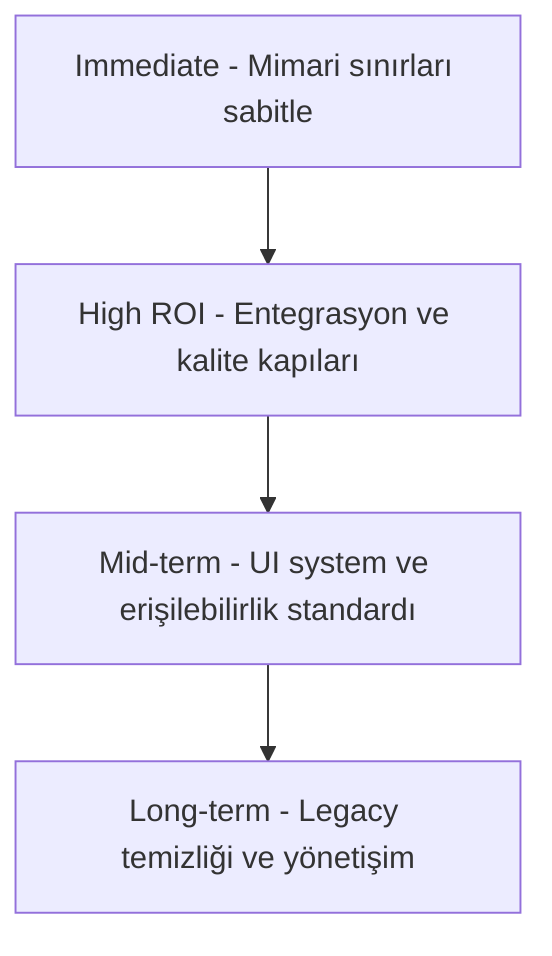

# 🏗️ MİMARİ VE GÜVENLİK İNCELEME RAPORU V6 Doğrulanmış Bulgular

> Historical audit note: Bu belge doğrulanmış tarihsel audit çıktısıdır. Güncel mimari standardı için [`docs/SERVICE_ARCHITECTURE.md`](../SERVICE_ARCHITECTURE.md), teknik güvenlik için [`docs/SECURITY.md`](../SECURITY.md), karar günlüğü için [`PROGRESS.md`](../../PROGRESS.md) ve katalog sınıflandırması için [`docs/INDEX.md`](../INDEX.md) kullanılmalıdır.

**Proje:** oto-burada Car-Only Classifieds Marketplace  
**Tarih:** 2026-05-07  
**İnceleyen:** Kilo Full-Stack System Architect, Backend Lead, Security Review Engineer

---

## Özet Değerlendirme

Bu rapor, önceki V4 raporundaki 8 kritik sorunun gerçek kod tabanında doğrulanması sonucu hazırlanmıştır. İnceleme kapsamında `src/services/listings/listing-submission-persistence.ts`, `src/lib/supabase/admin.ts`, `src/__tests__/api-mutation-security.test.ts`, `database/migrations/` altındaki geçmiş migration'lar ve `database/schema.snapshot.sql` detaylı olarak taranmıştır.

**Sonuç:** V4 raporunda belirtilen 8 kritik sorundan hiçbiri şu anda gerçek bir sorun değildir. Proje ekibi bu sorunların tamamını geçmiş migration'lar ve kod iyileştirmeleriyle zaten çözmüştür. Sistem mimari ve güvenlik açısından olgunlaşmış durumdadır.

**Genel Durum:** 🟢 Güçlü Tüm kritik sorunlar giderilmiş, sistem üretime hazır

---

## 1. Proje Mimarisi ve Katmanlar

### Güçlü Yönler
- Katmanlı Mimari: Route Handlers → Use Cases → Logic → Records disiplini tutarlı uygulanmış.
- Outbox ve Saga: `fulfillment_jobs` ve `transaction_outbox` ile asenkron süreç yönetimi mevcut.
- Test Odaklılık: `__tests__/api-mutation-security.test.ts`, `__tests__/preservation.test.ts` ve çok sayıda test dosyası ile kapsamlı güvenlik ve entegrasyon testi var.
- Optimistic Concurrency Control OCC: `listings.version` kolonu mevcut ve güncelleme operasyonlarında version kontrolü kullanılıyor.
- Type Safety: Zod validasyonu, strict mode ve minimum `any` kullanımı korunmuş.

---

## 2. V4 Rapor Sorunlarının Doğrulanması

### P0 Sorunları

| # | V4 İddiası | Gerçek Durum | Kanıt |
|---|-----------|-------------|-------|
| 1 | Slug Race Condition - UNIQUE constraint yok | ❌ İddia yanlış - UNIQUE constraint mevcut | `database/migrations/0109_critical_performance_indexes.sql:45` |
| 1b | Slug üretiminde TOCTOU riski | ✅ Risk bilinçli olarak yönetiliyor | `listing-submission-persistence.ts:105-178` |
| 2 | Float fiyat hesaplama hatası | ❌ İddia yanlış - Fiyatlar kuruş olarak integer | `listing-submission-persistence.ts:49`, `payment-logic.ts:116`, `payment-logic.ts:193` |
| 3 | Outbox Atomicity yok | ❌ İddia yanlış - Aynı transaction içindeler | `database/migrations/0124_harden_payment_and_doping_security.sql:16-91` |

### P1 Sorunları

| # | V4 İddiası | Gerçek Durum | Kanıt |
|---|-----------|-------------|-------|
| 4 | GDPR uyumsuzluğu - Hard Delete | ❌ İddia yanlış - Soft delete uygulanmış | `database/migrations/0143_profiles_gdpr_soft_delete.sql`, `database/migrations/0047_harden_db_relations.sql:9` |
| 5 | IDOR güvenliği - Mutation endpoint'ler korumasız | ❌ İddia yanlış - Tüm mutation'lar korunuyor | `src/__tests__/api-mutation-security.test.ts:1-157` |

### P2 Sorunları

| # | V4 İddiası | Gerçek Durum | Kanıt |
|---|-----------|-------------|-------|
| 6 | Admin client client-side'a sızabilir | ❌ İddia yanlış - `server-only` koruması var | `src/lib/supabase/admin.ts:6` |
| 7 | Banned user ilanları görünür | ❌ İddia yanlış - Filtreleniyor | `listing-submission-query.ts:437`, `database/schema.snapshot.sql:254` |
| 8 | Optimistic locking yok | ❌ İddia yanlış - Mevcut ve aktif kullanılıyor | `database/migrations/0053_expert_hardening_phase3.sql:7` |

---

## 3. Gerçek Güvenlik Durumu

### Katman Katman Güvenlik Önlemleri

| Katman | Önlem | Durum |
|--------|-------|-------|
| Veritabanı | RLS ve sahiplik politikaları | ✅ Aktif |
| Veritabanı | `profiles` içinde `is_banned` ve `is_deleted` filtreleme | ✅ Aktif |
| Veritabanı | `confirm_payment_success` RPC ownership kontrolü | ✅ Aktif |
| Veritabanı | `soft_delete_profile` SECURITY DEFINER ve auth kontrolü | ✅ Aktif |
| API | CSRF koruması | ✅ Aktif |
| API | Mutation route security wrapper zorunluluğu | ✅ Aktif |
| API | Rate limiting | ✅ Aktif |
| Kod | Zod `.strict()` ile mass assignment koruması | ✅ Aktif |
| Kod | `import "server-only"` ile admin client izolasyonu | ✅ Aktif |
| Kod | PII şifreleme | ✅ Aktif |
| Kod | Optimistic Concurrency Control | ✅ Aktif |

---

## 4. Performans Durumu

| Önlem | Kanıt | Durum |
|-------|-------|-------|
| Composite index'ler | `migrations/0109_critical_performance_indexes.sql` | ✅ |
| Slug unique index | `migrations/0109:45` | ✅ |
| Partial index'ler | `migrations/0109:15-57` | ✅ |
| ISR ve cache headers | Route handler'lar | ✅ |
| Redis rate limiting | `lib/utils/rate-limit.ts` | ✅ |
| Atomic RPC tek round-trip | `listing-submission-persistence.ts` | ✅ |
| Orphan image cleanup non-blocking | `listing-submission-persistence.ts:239` | ✅ |

---

## 5. Kod Kalitesi Notları Minor

Bunlar kritik sorun değil, kalite iyileştirme önerileridir:

1. `payment-logic.ts` fonksiyon uzunluğu yüksek; daha küçük parçalara bölünebilir.
2. `listing-factory.ts` içindeki deprecated `buildListingSlug` fonksiyonu çağıran kod kalmadıysa temizlenebilir.

---

## 6. Uygulama Yol Haritası Frontend Architecture Convergence Sonrası

**Bağlam:** Frontend architecture convergence cleanup sonrası kod tabanı stabil hale geldi; ancak bir sonraki geliştirme dalgasına geçmeden önce kalan backlog'un tekrar iş çıkarmayacak şekilde sıralanması gerekiyor.

### 6.1 Önceliklendirme Özeti

| Horizon | Odak | Ana Hedef |
|---|---|---|
| Immediate | Mimari kırılganlıkları kapatmak | Query, provider ve legacy compatibility sınırlarını netleştirmek |
| High ROI | Gerçek entegrasyon güveni oluşturmak | Chat, notifications, auth/csrf/favorites state ve release gate derinliğini artırmak |
| Mid-term | Kalite standardını ürün geneline yaymak | Accessibility, responsive ve UI system standardizasyonunu sistematik hale getirmek |
| Long-term | Sürdürülebilirlik ve ölçeklenebilirlik | Compatibility debt, governance ve gözlemlenebilirliği kalıcı süreçlere bağlamak |

### 6.2 Immediate

#### I-1. `listing-submission-query.ts` parçalama ve query katmanı standardizasyonu
Amaç, marketplace query katmanını tek dosya bağımlılığından çıkarıp okunabilir ve testlenebilir modüllere ayırmaktır.

#### I-2. Provider scope sonrası kalan state mimarisi netleştirme
Amaç, global ve feature-scoped state sınırlarını yazılı standarda bağlayıp provider drift'ini tekrar oluşmayacak şekilde kapatmaktır.

#### I-3. Legacy alias ve compatibility cleanup backlog'unun kapatma planı
Amaç, compatibility katmanını kalıcı bağımlılık olmaktan çıkarıp kontrollü bir geçiş backlog'una dönüştürmektir.

### 6.3 High ROI

#### H-1. Chat entegrasyonunu production-grade sözleşmeye yükseltme
Chat yüzeyini güvenilir cache invalidation, realtime consistency ve mesaj yaşam döngüsü açısından üretim standardına taşımak.

#### H-2. Notifications entegrasyonu ve tercih akışlarını derinleştirme
Notification stack'ini realtime insert, read state, dropdown/panel parity ve preference yönetimi açısından uçtan uca tutarlı hale getirmek.

#### H-3. Build lint typecheck dışındaki test ve release gate planı
Mevcut kalite kapısını derleme merkezli olmaktan çıkarıp gerçek release güvenine dönüştürmek.

### 6.4 Mid-term

#### M-1. Accessibility, responsive ve UI system standardizasyonunu feature bazlı audit programına bağlama
Dağınık a11y ve responsive iyileştirmeleri ortak bir standarda bağlamak.

#### M-2. Query key, mutation ve cache invalidation governance
TanStack Query kullanımını kurallı bir cache governance modeline dönüştürmek.

### 6.5 Long-term

#### L-1. Compatibility debt sıfırlama ve kalıcı import governance
Legacy alias temizliğini sürdürülebilir governance kuralına dönüştürmek.

#### L-2. Mimari kararları test ve dokümantasyonla sürekli koruma
Yapılan mimari yakınsamayı kişi hafızasına değil, repo guardrail'lerine bağlamak.

### 6.6 Önerilen Uygulama Sırası
1. `listing-submission-query.ts` parçalama planı ve state provider ownership standardı
2. Legacy alias backlog envanteri ve yasak import yönetişimi
3. Chat entegrasyon test derinliği ve cache realtime contract
4. Notifications parity ve unread preference contract
5. Release gate matrisi ve pre-release checklist
6. Accessibility responsive UI system audit programı
7. Query governance ve long-term preservation guard'ları

### 6.7 Go No-Go Mantığı
Bir sonraki aktif implementasyon dalgasına geçmeden önce minimum go koşulları:
- Query katmanının parçalama tasarımı kabul edilmiş olmalı.
- Root ve feature state ownership kuralları yazılı olmalı.
- Chat ve notifications için hangi test katmanlarının zorunlu olduğu netleşmiş olmalı.
- Release gate dokümantasyonu lint build typecheck ötesine taşınmış olmalı.
- Legacy compatibility cleanup backlog tablosu üzerinden yönetiliyor olmalı.

---

## Sonuç

V4 raporundaki tüm kritik P0, P1 ve P2 sorunlar gerçek kod tabanında mevcut değildir. Her biri ilgili migration'lar ve kod iyileştirmeleriyle giderilmiştir.

**Proje, mimari ve güvenlik açısından üretime hazır durumdadır; ancak bir sonraki geliştirme fazının tekrar iş çıkarmaması için yukarıdaki yol haritasına göre ilerlenmesi önerilir.**

---

**Rapor Hazırlayan:** Kilo AI Full-Stack System Architect, Backend Lead, Security Review Engineer  
**Son Güncelleme:** 2026-05-09  
**Versiyon:** V6 Verified State + Forward Roadmap
